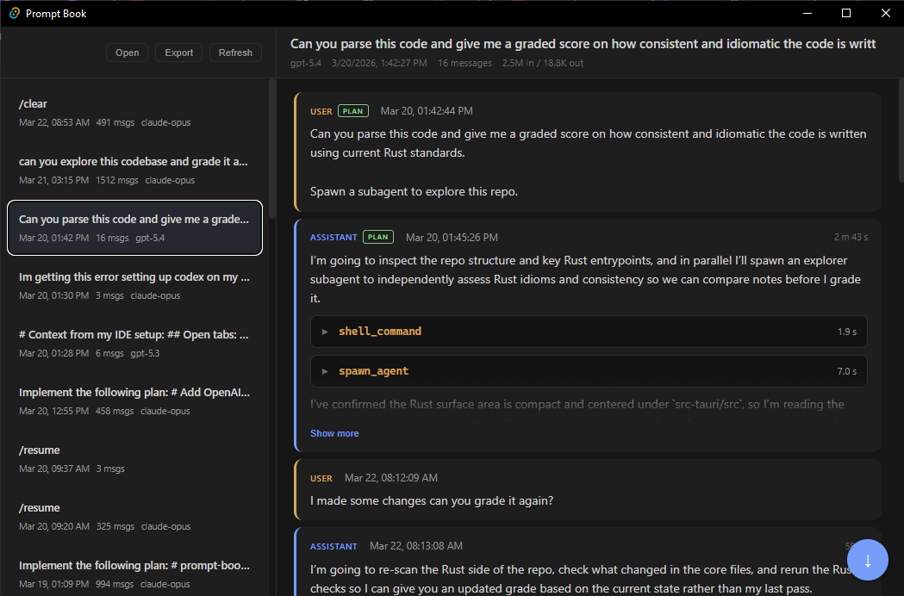

# Prompt Book

A native desktop viewer for your AI coding sessions. Prompt Book reads session transcripts from Claude Code, GitHub Copilot CLI, and OpenAI Codex CLI and renders them in a unified, browsable interface with collapsible tool calls, thinking blocks, token usage stats, and one-click HTML export.

Built with Tauri v2, React 19, and Rust.



## Install

### macOS (Homebrew)

```bash
brew tap andrewmassart/tap
brew install prompt-book
```

### Windows

Download the `.exe` installer from the [latest release](https://github.com/andrewmassart/prompt-book/releases/latest).

## What it does

Prompt Book auto-discovers JSONL session files from:

| Platform | Location |
|---|---|
| Claude Code | `~/.claude/projects/` |
| GitHub Copilot CLI | `~/.copilot/session-state/` |
| OpenAI Codex CLI | `~/.codex/sessions/` |

Each session is parsed into a unified conversation view showing messages, tool calls, thinking blocks, code blocks, and images. You can also drag-and-drop or open any `.jsonl` file directly.

## Features

- **Multi-platform parsing** — Claude Code, Copilot CLI, and Codex CLI sessions in one place
- **Rich content rendering** — tool calls with inputs/outputs, thinking blocks, code blocks with language labels, and inline images
- **Collapsible everything** — long messages, tool calls, and thinking blocks auto-collapse with expand/collapse controls
- **Session metadata** — model name, timestamps, message count, token usage (including cache read/write), git branch, and working directory
- **Mode indicators** — visual badges for plan mode, auto-accept mode, and sub-agent messages
- **HTML export** — save any session as a self-contained HTML file for sharing or archiving
- **Drag-and-drop** — drop `.jsonl` files onto the window to view them instantly
- **In-memory caching** — switch between sessions without re-parsing

## Tech stack

| Layer | Technology |
|---|---|
| Desktop shell | Tauri 2 |
| Frontend | React 19 + React Compiler |
| Backend / parsing | Rust (serde, walkdir, chrono) |
| Build | Vite 7 |

## Development

### Prerequisites

- [Node.js](https://nodejs.org/) v18+
- [Rust](https://rustup.rs/)

### Run locally

```bash
git clone https://github.com/andrewmassart/prompt-book.git
cd prompt-book
npm install
npm run tauri dev
```

### Build

```bash
npm run tauri build
```

Produces platform-specific installers in `src-tauri/target/release/bundle/`.

## License

MIT
